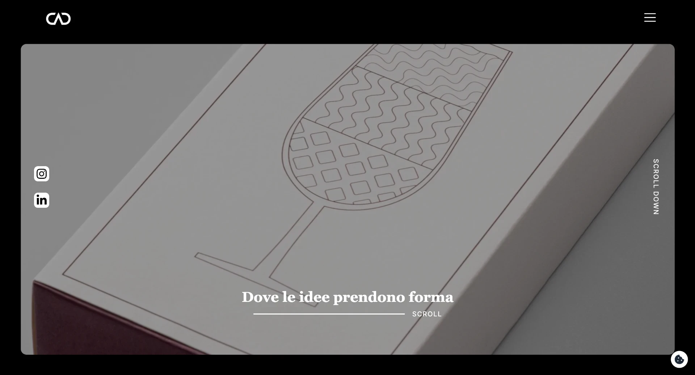
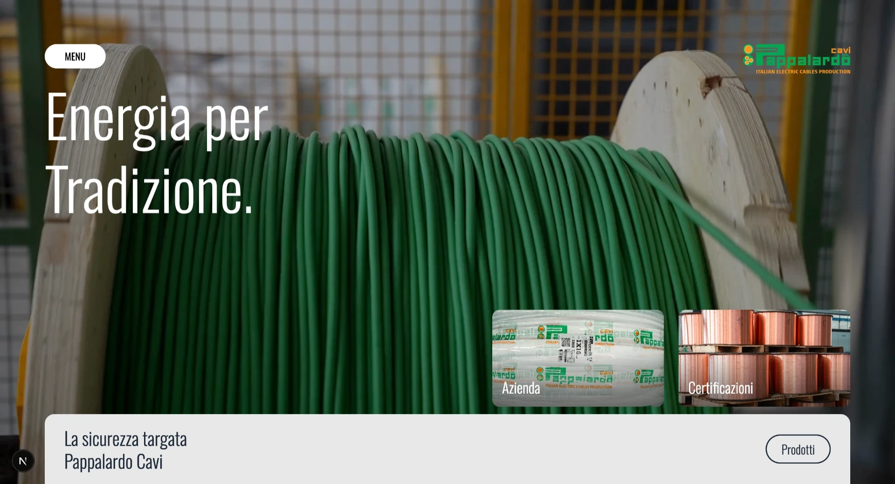
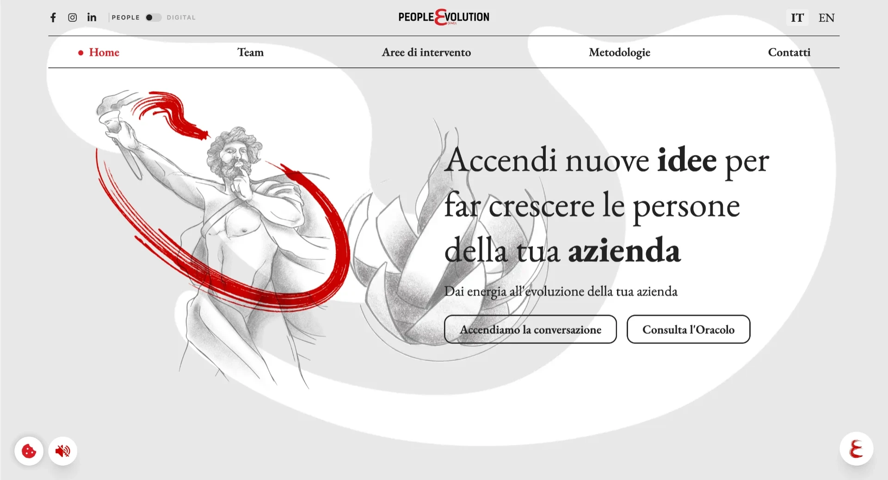
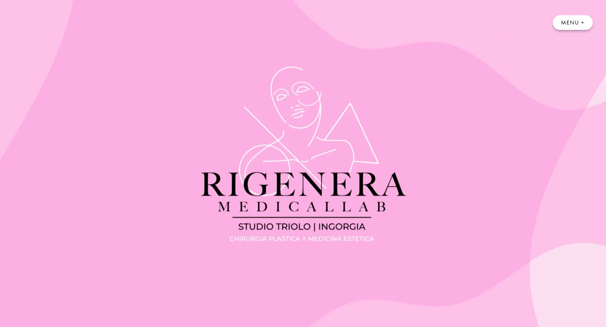

# Ciao, sono Giuseppe! 👋
### Full Stack Developer da Catania, Sicilia 🌋

Sviluppatore appassionato con focus su **React**, **TypeScript** e tecnologie web moderne. Mi piace costruire interfacce intuitive e scrivere codice pulito — o almeno provarci, prima di scoprire che il bug era un punto e virgola.

- 🔭 Attualmente lavoro su progetti **Full Stack** con React e Next.js
- 🌱 Sempre in fase di apprendimento: ogni giorno c'è qualcosa di nuovo da esplorare
- 💬 Chiedimi di **JavaScript, React, TypeScript** o di qualsiasi cosa legata al web
- ⚡ Fun fact: *Risolvo bug che ho creato 5 minuti prima*

---

## 🛠️ Tech Stack

**Frontend**

    
    
    
    
    
    
    

**Backend & Altro**

    
    
    
    

**Strumenti**

    
    
    
    

---

## 🚀 Progetti in evidenza

> Una selezione dei lavori realizzati per <strong><a href="https://planstudios.it/" target="_blank" rel="noopener noreferrer">Plan Studios</a></strong>. Puoi vedere tutti i progetti sul mio <a href="https://tuosito.com" target="_blank" rel="noopener noreferrer">portfolio online</a>.

<table>
  <tr>
    <td width="50%" valign="top">
      
      <h3>🏢 Castellano AD</h3>
      
<em>Sito aziendale · 2025</em>

      
Sito istituzionale moderno e responsive realizzato per Castellano AD. Focus su web design, sviluppo e ottimizzazione cross-device.

      

        
        
      

      <a href="https://www.castellanoad.com/it" target="_blank" rel="noopener noreferrer">🌐 Visita il sito</a>
    </td>
    <!-- Pappalardo Cavi — temporaneamente nascosto. Rimuovi i tag di commento per ripristinare.
    <td width="50%" valign="top">
      
      <h3>🔌 Pappalardo Cavi</h3>
      
<em>Sito vetrina · 2026</em>

      
Sito vetrina per Pappalardo Cavi: presentazione dei prodotti e dell'azienda con un'esperienza utente curata e completamente responsive.

      

        
        
      

      <a href="https://www.pappalardocavi.com/" target="_blank" rel="noopener noreferrer">🌐 Visita il sito</a>
    </td>
    -->
    <td width="50%" valign="top"></td>
  </tr>
  <tr>
    <td width="50%" valign="top">
      
      <h3>👥 People Evolution</h3>
      
<em>Sito vetrina · 2025</em>

      
Sito vetrina multilingua per People Evolution: design pulito, sviluppo da zero e attenzione alla performance su ogni dispositivo.

      

        
        
      

      <a href="https://www.people-evolution.it/it" target="_blank" rel="noopener noreferrer">🌐 Visita il sito</a>
    </td>
    <td width="50%" valign="top">
      
      <h3>🧬 Rigenera Medical Lab</h3>
      
<em>Sito web · 2026</em>

      
Sito web per Rigenera Medical Lab: identità visiva curata, struttura chiara e sviluppo responsive per il settore medicale.

      

        
        
      

      <a href="https://rigeneramedicallab.com/" target="_blank" rel="noopener noreferrer">🌐 Visita il sito</a>
    </td>
  </tr>
</table>

---

## 🤝 Connettiti con me

    
    
    
    

---

## 📊 GitHub Stats

    

 

    

    
    

---

> *Credo nel miglioramento continuo attraverso il confronto e la collaborazione. Ogni progetto è un'opportunità per imparare qualcosa di nuovo.*

    

